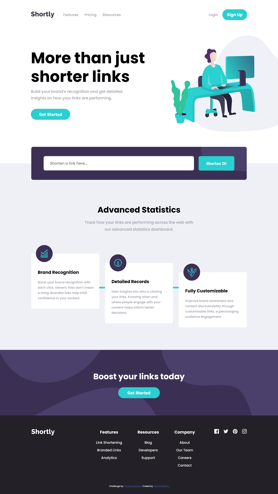
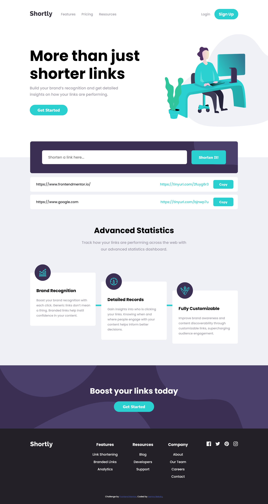
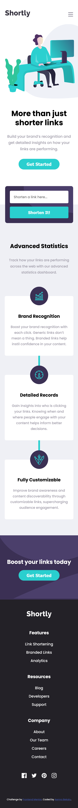

# Frontend Mentor - Shortly URL shortening API Challenge solution

This is a solution to the [Shortly URL shortening API Challenge challenge on Frontend Mentor](https://www.frontendmentor.io/challenges/url-shortening-api-landing-page-2ce3ob-G). Frontend Mentor challenges help you improve your coding skills by building realistic projects.

## Table of contents

- [Overview](#overview)
  - [The challenge](#the-challenge)
  - [Screenshot](#screenshot)
  - [Links](#links)
- [My process](#my-process)
  - [Built with](#built-with)
  - [What I learned](#what-i-learned)
  - [Continued development](#continued-development)
  - [Useful resources](#useful-resources)
- [Author](#author)
- [Acknowledgments](#acknowledgments)

## Overview

### The challenge

Users should be able to:

- View the optimal layout for the site depending on their device's screen size
- Shorten any valid URL
- See a list of their shortened links, even after refreshing the browser
- Copy the shortened link to their clipboard in a single click
- Receive an error message when the `form` is submitted if:
  - The `input` field is empty

### Screenshot

- desktop view
  

-desktop view with shorten links

- mobile view
  

### Links

- Solution URL: [Add solution URL here](https://your-solution-url.com)
- Live Site URL: [Add live site URL here](https://your-live-site-url.com)

## My process

### Built with

- Semantic HTML5 markup
- CSS custom properties
- Flexbox
- CSS Grid
- Mobile-first workflow
- javascript

### What I learned

in this challenge the new thing which I have learned is how I can work with copy to the clipboard feature.

### Useful resources

- [The Complete Javascript Course By Jonas Schmedtmann](https://www.udemy.com/course/the-complete-javascript-course/) - This helped me to get back to read about the javascript stuff which I need to do the work in this challelnge.

- [Tiny Url](https://tinyurl.com/api-create.php?url=) - this helped me to generate the shorten url for the link which is put inside the form.

## Author

- Frontend Mentor - [@aemrobe](https://www.frontendmentor.io/profile/aemrobe)
- Twitter - [@Aemro112](https://www.twitter.com/Aemro112)

## Acknowledgments

when I do this challenge I got some issue with the api stuff. the API hich is provided with this challenge doesn't work. I have searched the posts which are posted related to this challenge. this alternative API(I have mentioned above at the useful resources) which is recommended by [@Shaswat0707](https://github.com/Shaswat0707) has helped me and I want to say thanks for that.
